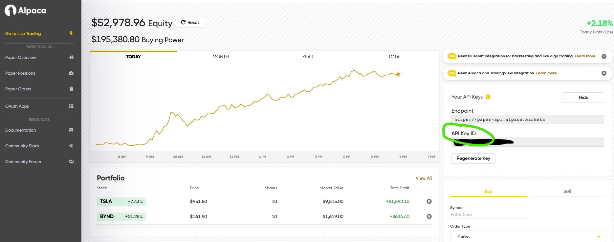

#   Algo Trading With Alpaca API
#### 	What does this app do?
	This app allows you to back test and configuring trigger trading strategy based on technical indicators and price point.
#### Prerequisite 
	1. SignUp for Alpaca API https://alpaca.markets/
	2. Minimal Programming
	 
	
####  What is Nashorn doing here?
	Cute Nashorn here enables you to express the strategy with JavaScript syntax but will be converted to byte code in the runtime.
	You will have access to Java Objects references inside the script.
	Refer https://www.baeldung.com/java-nashorn

####  How do I back test my idea?

		
		

####  What is Ta4j?
		A Java library for technical trading indicators , you can find it here https://github.com/ta4j/ta4j

#### How do I learn Trading Indicators?		
		There are more resources out there in the internet and youtube to understand about trading indicators. Make your self familiar with it first.		
		Below blog is the good starting point.
		https://medium.com/@harrynicholls/7-popular-technical-indicators-and-how-to-use-them-to-increase-your-trading-profits-7f13ffeb8d05

####  What is paper trading?
	As the name suggests , Paper Trading environment uses the live market data but your stock purchases are not real. You can use this as the test environment.

##### Installation
	1. Download Shell "alpacaTradeShell.sh" from script folder.
	2. Download --jar-- from the dist folder and place it in your work directory	
	3. Update your directory for the jar in the shell script

#### How do I get API Key Credentials?
	You need to open the trading account with https://alpaca.markets/. They are providing Commision free API Service.
	You can get api credentials for paper trading from https://app.alpaca.markets/paper/dashboard/overview

	

#### Stopping All the trades?

#### Raise an Issue

		